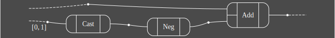

<div style="text-align: center;" align="center">
<h1>open hypergraphs</h1>

[![Crate][crate_img]][crate_link]
[![Documentation][docs_img]][docs_link]
[![License][license_img]][license_file]

</div>

Open Hypergraphs are a general, differentiable and data-parallel datastructure for syntax. Here’s a few examples of suitable uses:

- Differentiable array programs for deep learning (in [catgrad][catgrad]).
- Proofs and terms in first order logic
- Programs in the λ-calculus
- Circuits with feedback

This code is an implementation of the paper
[Data-Parallel Algorithms for String Diagrams](https://arxiv.org/pdf/2305.01041).

# Features

- An imperative interface
  for constructing open hypergraphs in Rust
  the [lax module](https://docs.rs/open-hypergraphs/latest/open_hypergraphs/lax/index.html))
- Data-parallel algorithms for algebraic operations
  (the [strict module](https://docs.rs/open-hypergraphs/latest/open_hypergraphs/strict/index.html))
- Data-parallel diagram layering and decomposition
- Functors, including optic transformation for ahead-of-time differentiation of
  syntax

# Experimental APIs

Some APIs are marked experimental and are disabled by default.

Enable experimental APIs with Cargo features:

```toml
[dependencies]
open-hypergraphs = { version = "0.2.10", features = ["experimental"] }
```

or on the command line:

```bash
cargo test --features experimental
```

# Examples

An example for defining a simple expression language ([polynomial
circuits](https://www.sciencedirect.com/science/article/pii/S2352220823000469))
and evaluating its terms is given [here](./examples/polycirc.rs).

A complete example showing term construction, rendering as SVG using [open-hypergraphs-dot][oh-dot], and
serialization to JSON can be found [here](./examples/serde/).
This example produces the following open hypergraph:



which serializes to JSON as below:

```json
{
    "sources": [3,0],
    "targets": [4],
    "hypergraph": {
        "nodes":[
            {"Interval":{"lower":0,"upper":1}},
            "Int","Int","Int","Int"
        ],
        "edges": ["Cast","Neg","Add"],
        "adjacency": [
            {"sources":[0],"targets":[1]},
            {"sources":[1],"targets":[2]},
            {"sources":[3,2],"targets":[4]}
        ],
        "quotient":[[],[]]
    }
}
```

[crate_link]: https://crates.io/crates/open-hypergraphs "Crate listing"
[crate_img]: https://img.shields.io/crates/v/open-hypergraphs.svg?style=for-the-badge&color=f46623 "Crate badge"
[docs_link]: https://docs.rs/open-hypergraphs/latest/open-hypergraphs "Crate documentation"
[docs_img]: https://img.shields.io/docsrs/open-hypergraphs/latest.svg?style=for-the-badge "Documentation badge"

[license_file]: https://github.com/hellas-ai/open-hypergraphs/blob/master/LICENSE-MIT "Project license"
[license_img]: https://img.shields.io/crates/l/open-hypergraphs.svg?style=for-the-badge "License badge"

[oh-dot]: https://github.com/hellas-ai/open-hypergraphs-dot
[catgrad]: https://catgrad.com
